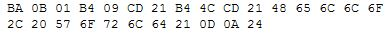

# Introducción {#intro}

## ¿De que hablamos cuando hablamos de lenguaje?

Si vamos a la [wikipedia](https://es.wikipedia.org/wiki/Lenguaje): _Un **lenguaje** es un sistema de comunicación estructurado para el que existe un contexto de uso y ciertos principios combinatorios formales_. En cuanto a la [Real academia española](http://dle.rae.es/?id=N7BnIFO): la definición más general habla de la _Facultad del ser humano de expresarse y comunicarse con los demás a través del sonido articulado o de otros sistemas de signos_. Todos estos son conceptos que aplican a la totalidad de los lenguajes creados fundamentalmente por el hombre (algunos animales manejan un cierto lenguaje también) y los lenguajes informáticos en particular, no dejan de ser otro lenguaje más. Infinitamente más limitados en su vocabulario, inflexibles en cuanto a su sintaxis, los lenguajes informáticos o de programación, no dejan de ser, como cualquier otra lengua, una forma de comunicación, principalmente entre un ser humano y una máquina (computadora).

## Un poco de Historia (y de contexto)

Los lenguajes de programación preceden a la computadora en más de un siglo. A comienzos del siglo XIX, se crea un los primeros códigos para comunicarse con una maquina, fue el usado para "programar" el [telar de Jacquard](https://es.wikipedia.org/wiki/Telar_de_Jacquard) mediante un sistema similar al de las tarjetas perforadas de las primeras computadoras. El "código" en estas maquinas definían los patrones que luego aplicaría en el tejido final. 

```{r echo=FALSE, out.width='40%', fig.align="center", fig.cap='Un telar de Jacquard', fig.pos="h"}
knitr::include_graphics('./img/Jacquard.loom.cards.jpg')
```

Más allá de este antecedente, al menos hoy, hay un consenso casi general, en que el hito inicial, fue la creación de un código para calcular los números de Bernoulli mediante la [maquina analítica de Charles Babbage](https://es.wikipedia.org/wiki/M%C3%A1quina_anal%C3%ADtica) en 1842 por parte de la que se considera la primera programadora de la historia: [Ada Lovelace](https://es.wikipedia.org/wiki/Ada_Lovelace). Lo interesante es que la maquina de Babbage, considerada también hoy como la primer computadora, nunca llegó a construirse, ya sea por desición política, de costos o técnica, solo fue un diseño en papel, lo que perduró fue este diseño y algunos prototipos incompletos.

```{r echo=FALSE, out.width='40%', fig.align="center", fig.cap='Un modelo parcial de la maquina de Babbage', fig.pos="h"}
knitr::include_graphics('./img/Analytical_Engine.jpg')
```

Otro consenso es definir a la ENIAC (Electronic Numerical Integrator And Calculator) finalizada en 1945, como la primera computadora moderna de uso general. Esta y otras computadoras posteriores que le siguieron, se "programaban", es decir, se les decía que es lo que tenía que calcular/hacer directamente modificando el hardware, cambiando interruptores o modificando las conexiones. Pronto esto hizo claro que se debía contar con una forma de comunicarse con la maquina de forma más práctica y menos costosa, por lo que se empiezan a definir los primeros lenguajes de programación. 

```{r echo=FALSE, out.width='40%', fig.align="center", fig.cap='Programando la ENIAC'}
knitr::include_graphics('./img/Classic_shot_of_the_ENIAC.jpg')
```

En esta etapa es que aparece el concepto de lenguaje de maquina, algo que no ha cambiado hasta nuestros días: la maquina, la computadora reconoce un único lenguaje, llamado de maquina, este es propio de cada arquitectura/hardware. Un lenguaje de maquina al comienzo era una simple configuración de interruptores, hoy en día es un amplio pero finito conjunto de intrucciones representadas por códigos binarios. Este lenguaje es incomprensible para la mayor parte de los seres humanos, pronto la industria se dió cuenta que escribir programas directamente de esta forma era inviable, surge entonces un proceso conocido como ensamblado y un lenguaje llamado "Assembler". El "Assembler" de igual forma que el lenguaje de maquina depende de cada arquitectura, no es más que una escritura nemotecnica y más clara de una secunecia de instrucciones que pueden ser "traducidas" directamente al lenguaje de maquina. 

Para entender lo que es un lenguaje "assembler", podríamos imaginar una instrucción de bajisimo nivel, como ser, colocar un valor determinado en un registro de la CPU. (Nota: los registros en las arquitecturas actuales son zonas de memoria dentro del propio chip de la CPU). Por ejemplo, si quisieramos colocar el valor `1970` al registro denominado `AX`, la instrucción en código de maquina sería algo así: `0110 0110 1011 1000 1011 0010 0000 0111`, si se lo quiere ver en hexadecimal `66 B8 B2 07`, sin embargo el código ensamblador sería significativamente más comprensible: `MOV AX, 1970`.


Ejemplo de uno de los programas más sencillos y clásicos, el archiconocido "Hola, Mundo" en Assembler:

```
org 100h
mov dx,msg
mov ah,9
int 21h
mov ah,4Ch
int 21h
msg db 'Hello, World!',0Dh,0Ah,'$'
```

Sin duda muy poco claro para el neofito del lenguaje, pero sin duda una mejora a tener que escribir el código directamente en lenguaje de maquina.


```{r echo=FALSE, out.width='40%', fig.align="center", fig.cap='Ejemplo de los códigos hexadecimales (código de maquina) del programa anterior'}

```

Durante la decada de 1950, se desarrollan los primeros lenguajes de bajo nivel, los **assemblers**, sin embargo, cada vez más los requerimientos eran mayores, los problemas más difícles, los algoritmos más complejos. Pronto se hizo evidente que escribir código en Assembler, si bien mejor que hacerlo directamente en el código de la maquina, era inviable. Nacen los primeros lenguajes de alto nivel. Estos, son con los que se escriben la mayor parte de los programas hoy en día, **R** de hecho es un lenguaje de alto nivel. 

En un lenguaje de bajo nivel, es decir, código assembler, se escribe para una maquina determinada, se usan las instrucciones que define cada arquitectura. Por el contrario, los lenguajes de alto nivel, definen un conjunto más limitado de instrucciones, y logran la abstracción con el hardware. Cuando se escribe código de alto nivel, se escribe para una maquina abtracta. 

Uno de los primeros lenguajes de alto nivel de este periodo, que apareció en 1957, fue: **FORTRAN** (The IBM Mathematical **For**mula **Tran**slating System). Lo menciono por sobre otro más famoso tal vez en esa etapa como **COBOL**, por que en **R** hay muchos paquetes, es decir funcionalidad extra del lenguaje, que aún hoy, está escrita tanto en **FORTRAN**, como en otro lenguaje posterior (1972) y altamente extendido aún hoy como **C**. 

Hasta ahora sabemos que los lenguajes pueden categorizarse según el nivel de abstracción con la arquitectura:

* Código de maquina
* Lenguajes de bajo nivel; **assembler**
* Lenguajes de alto nivel: **FORTRAN**, **BASIC**, **C**, **R**, **JAVA**, **Python**, etc.

Sin embargo otra categorización que es importante conocer es la del resultado final que el lenguaje producirá, al respecto hay dos categorías básicas:

* Lenguajes compilados
* Lenguajes interpretados

Los primeros 


