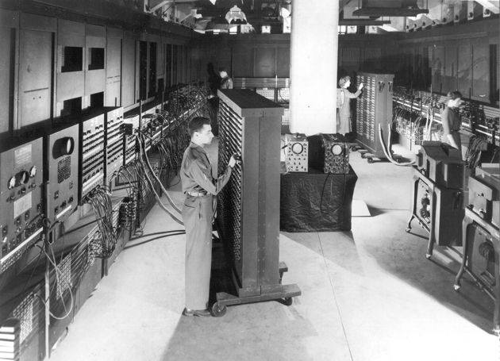

# Introducción {#intro}

## ¿De que hablamos cuando hablamos de lenguaje?

Si vamos a la [wikipedia](https://es.wikipedia.org/wiki/Lenguaje): _Un **lenguaje** es un sistema de comunicación estructurado para el que existe un contexto de uso y ciertos principios combinatorios formales_. En cuanto a la [Real academia española](http://dle.rae.es/?id=N7BnIFO): la definición más general habla de la _Facultad del ser humano de expresarse y comunicarse con los demás a través del sonido articulado o de otros sistemas de signos_. Todos estos son conceptos que aplican a la totalidad de los lenguajes creados fundamentalmente por el hombre (algunos animales manejan un cierto lenguaje también) y los lenguajes informáticos en particular, no dejan de ser otro lenguaje más. Infinitamente más limitados en su vocabulario, inflexibles en cuanto a su sintaxis, los lenguajes informáticos o de programación, no dejan de ser, como cualquier otra lengua, una forma de comunicación, principalmente entre un ser humano y una máquina (computadora).

## Un poco de Historia (y de contexto)

Los lenguajes de programación preceden a la computadora en más de un siglo. A comienzos del siglo XIX, se crea un los primeros códigos para comunicarse con una maquina, fue el usado para "programar" el [telar de Jacquard](https://es.wikipedia.org/wiki/Telar_de_Jacquard) mediante un sistema similar al de las tarjetas perforadas de las primeras computadoras. El "código" en estas maquinas definían los patrones que luego aplicaría en el tejido final. 
```{r echo=FALSE, out.width='40%', fig.align="center", fig.cap='Un telar de Jacquard'}
knitr::include_graphics('./img/Jacquard.loom.cards.jpg')
```

Más allá de este antecedente, al menos hoy, hay un consenso casi general, en que el hito inicial, fue la creación de un código para calcular los números de Bernoulli mediante la [maquina analítica de Charles Babbage](https://es.wikipedia.org/wiki/M%C3%A1quina_anal%C3%ADtica) en 1842 por parte de la que se considera la primera programadora de la historia: [Ada Lovelace](https://es.wikipedia.org/wiki/Ada_Lovelace). Lo interesante es que la maquina de Babbage, considerada también hoy como la primer computadora, nunca llegó a construirse, ya sea por desición política, de costos o técnica, solo fue un diseño en papel, lo que perduró fue este diseño y algunos prototipos incompletos.

```{r echo=FALSE, out.width='40%', fig.align="center", fig.cap='Un modelo parcial de la maquina de Babbage'}
knitr::include_graphics('./img/Analytical_Engine.jpg')
```

Otro consenso es definir a la ENIAC (Electronic Numerical Integrator And Calculator) finalizada en 1945, como la primera computadora moderna de uso general. Esta y otras computadoras posteriores que le siguieron, se "programaban", es decir, se les decía que es lo que tenía que calcular/hacer directamente modificando el hardware, cambiando interruptores o modificando las conexiones. Pronto esto hizo claro que se debía contar con una forma de comunicarse con la maquina de forma más práctica y menos costosa, por lo que se empiezan a definir los primeros lenguajes de programación

```{r echo=FALSE, out.width='40%', fig.align="center", fig.cap='Programando la ENIAC'}

```

